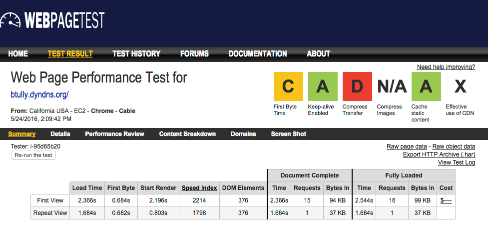
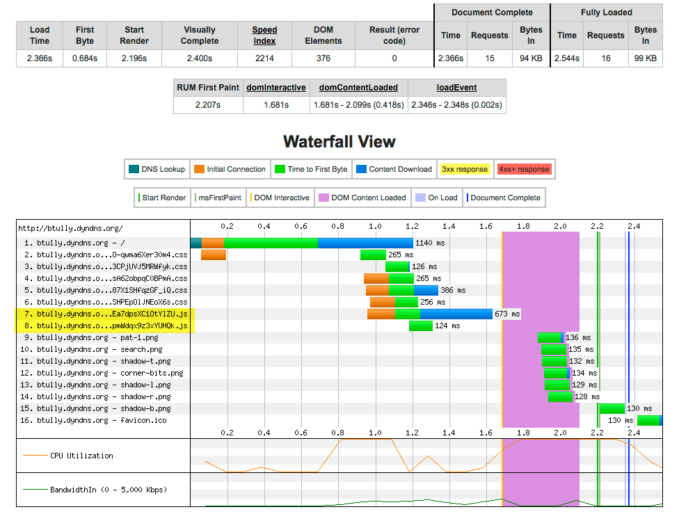
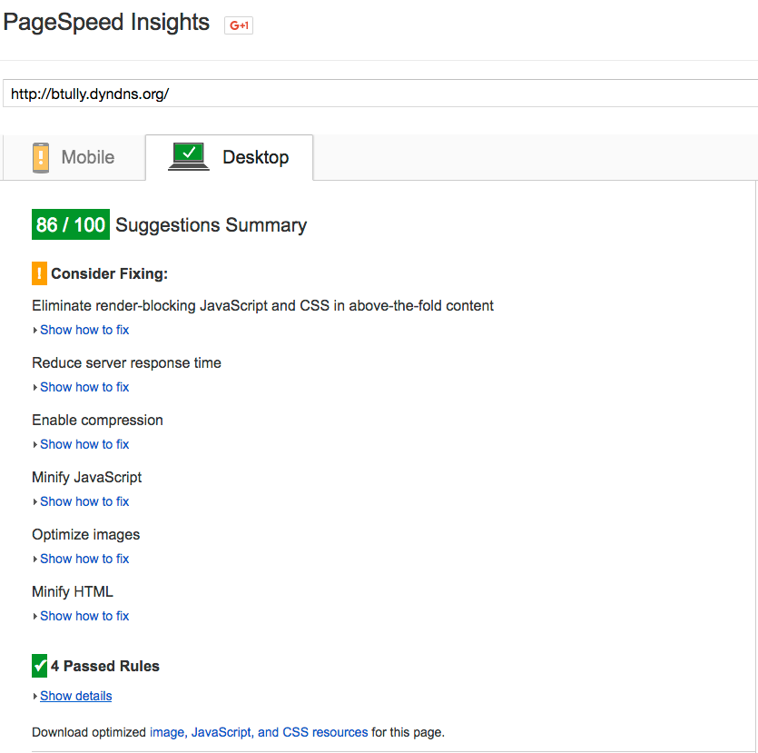

**Disclaimer**

Note that all tools/services used in this report were measuring the site as hosted on my 2012 MacBook Pro connected to the Internet via WiFi and using DynamicDNS and a router configured with port forwarding to send external requests to my laptop. This introduces some latency and should be taken into consideration when looking at final numbers. A Drupal site hosted on Acquia Cloud surely would have much better numbers :)

# 1. Initial Benchmarks

Since our scope is performance and not scalability, we gathered some initial performance metrics using ApacheBench to test the web server response time.

<pre>ab -r -k -c 1 -n 100000000 -t 300 http://btully.dyndns.org/</pre>

The above command sends a request to the site for a total of 5 minutes so that we can see the effect of any cron/cache clear.

### Server Response Results: ApacheBench
<pre>
Finished 756 requests

Server Software:        Apache
Server Hostname:        btully.dyndns.org
Server Port:            80

Document Path:          /
Document Length:        36344 bytes

Concurrency Level:      1
Time taken for tests:   300.038 seconds
Complete requests:      756
Failed requests:        0
Keep-Alive requests:    0
Total transferred:      27849528 bytes
HTML transferred:       27476064 bytes
Requests per second:    2.52 [#/sec] (mean)
Time per request:       396.876 [ms] (mean)
Time per request:       396.876 [ms] (mean, across all concurrent requests)
Transfer rate:          90.64 [Kbytes/sec] received

Connection Times (ms)
              min  mean[+/-sd] median   max
Connect:        2    4   0.6      4       7
Processing:   347  393  44.6    378     803
Waiting:      337  381  44.1    366     788
Total:        351  397  44.6    382     806

Percentage of the requests served within a certain time (ms)
  50%    382
  66%    395
  75%    413
  80%    425
  90%    440
  95%    468
  98%    512
  99%    568
 100%    806 (longest request)
 </pre>
 
 Server Response (waiting, processing) is in the **400 ms** response range on average, so we'll see if we can improve that.

### Server Response Results: Siege
<pre><code>
Transactions:		         800 hits
Availability:		      100.00 %
Elapsed time:		       34.33 secs
Data transferred:	        7.64 MB
Response time:		        0.40 secs
Transaction rate:	       23.30 trans/sec
Throughput:		        0.22 MB/sec
Concurrency:		        9.23
Successful transactions:         800
Failed transactions:	           0
Longest transaction:	        7.94
Shortest transaction:	        0.00
</code>
</pre>

The seige tool confirms that there is an average .40s (400ms) reponse time, and our longest transaction was **7.94 seconds**.

###  Page Load Results: WebPageTest

We used WebPageTest.org to gather initial performance metrics on page load performance. 

First view load time was **2.36s** with repeat view of **1.68s**. Time-to-first-byte (TTFB) was **684ms**.

  

###  Page Load Results: Google PageSpeed Insights

Google PageSpeed Insights revealed a score of **86 / 100** and suggested some changes to improve performance (see below).

---

### Initial Benchmarks Analysis

There are some **front end** optimizations we can implement by:
* minifying Javascript
* further aggregating CSS
* moving Javascript to the footer and adding "defer" and async where possible in order to avoid the blocking of the page rendering
* optimizing PNG images

### Next Steps
Explore potential **back end** and **configuration** optimization opportunties by:
* profiling pages using xhprof and enabling MySQL slow query log
* using Percona Toolkit to help identify troublesome database queries
* identifying existing code that can be refactored to improve performance
* ensure a proper cache configuration strategy is implemented for all relevant pieces of the puzzle:
  * Page cache
  * Block cache
  * Views cache (both query and render cache)
  * Panels cache
* Once all views have been properly configured with caching, export the views and place in a new module so that when a view is called it gets loaded from file rather than the database. With a proper opcode cache set up, this will be much faster than loading the view from the database.
* ensure database logging is disabled and that syslog is enabled
* explore use of external cache to reduce database usage and speed up queries (Memcached, Redis)
* explore use of proxy server as an additional cache layer in front of Drupal (Varnish)
* ensure cron (Drupal's "poormanscron") is disabled and that cron is being run as an external process (crontab, drush) to avoid users triggering cron and waiting for it to finish before page loads
* perhaps explore cron modules like Elysia Cron or Ultimate Cron that allow more granular timings/groupings (i.e., import feeds every 5 minutes, but update search index every hour, etc)  
* explore piggybacking on cron so that when Drupal's cron runs to import feeds and clear cache, a script runs immediately afterwards to "prime the cache"

---

### [Next: Discovery/Recommendations](02-discovery-recommendations.md)
