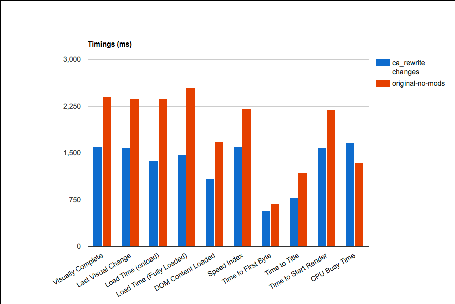
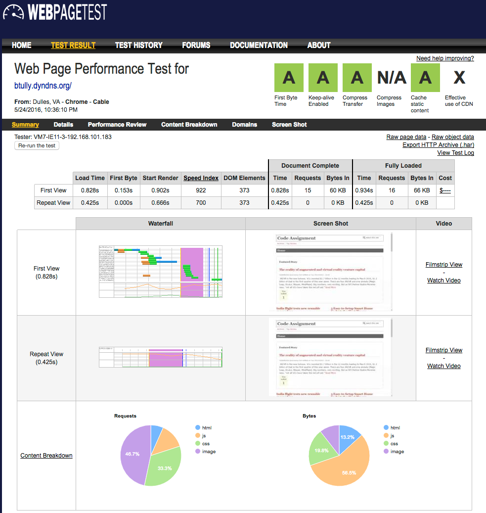
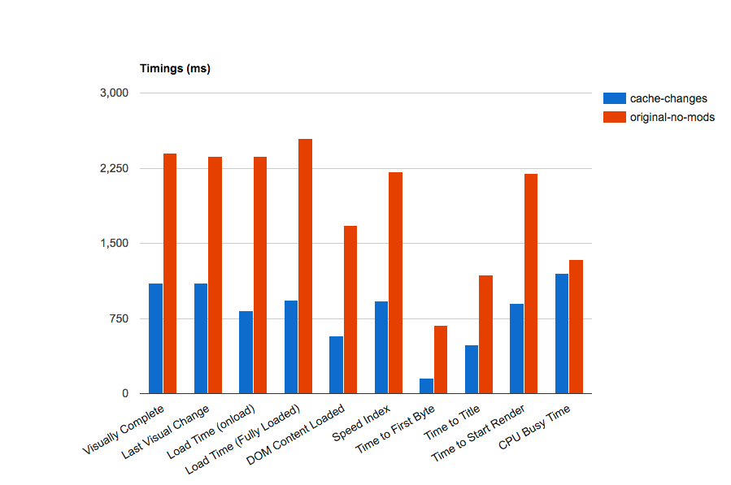
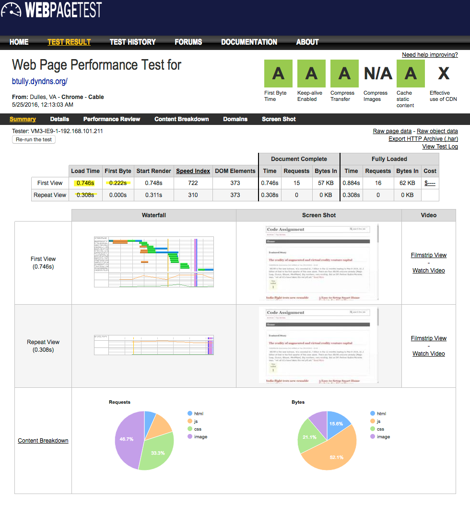
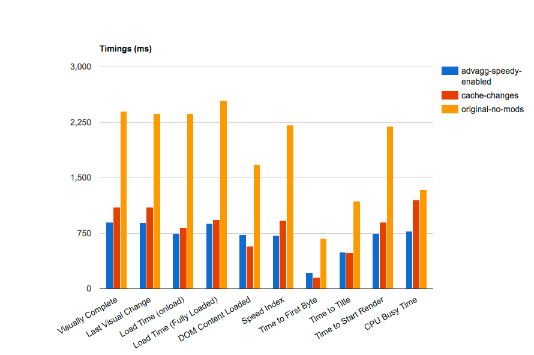
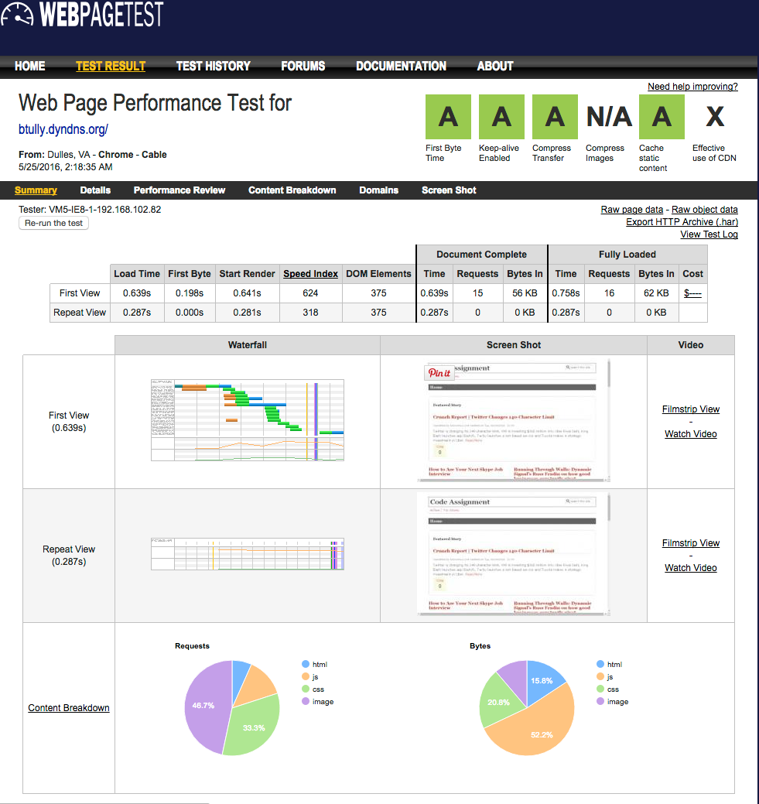
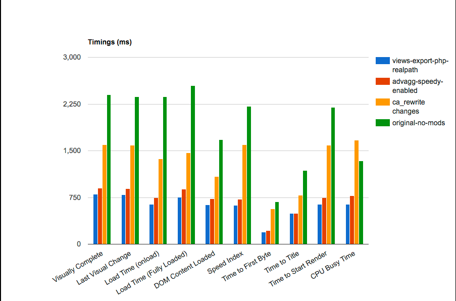
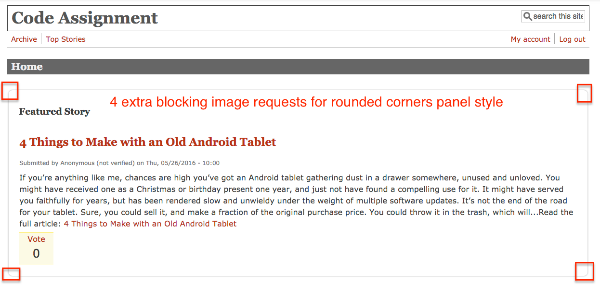
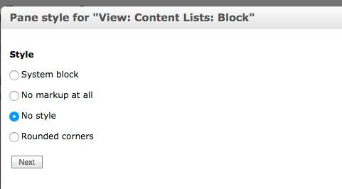
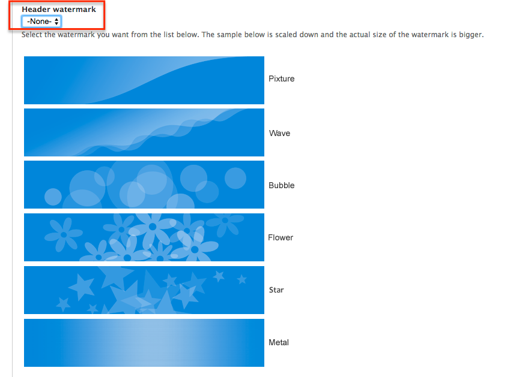

# 2. Discovery/Recommendations

## xhprof Profiling

The use of the xhprof profiler did not reveal anything obvious. There were significant calls to the database for cache getting/setting (even with cache disabled), so this promotes the idea of using an external cache like Memcached to offload these calls from the database and improve performance.

**RECOMMENDATION: Install/configure Memcached
**

## Percona Toolkit / MySQL Slow Query Log

The MySQL slow query log was enabled in order to highlight any potential troublesome queries. Originally run with the default 1s limit, this produced no entries -- even with repeated cache clears and cron runs and using apachebench and siege to send many requests to the website. We reduced the limit down to 50ms and then 5ms before we started seeing entries. All queries were run through MySQL's EXPLAIN function to ensure they were using proper indexes and were optimized.

**RECOMMENDATION: No obvious optimizations discovered at this time
**

## Drupal 8 Considerations
Some consideration was given to suggest a migration to Drupal 8 in order to take advantage of some of the performance benefits that the [BigPipe project](https://www.drupal.org/project/big_pipe) provides. The more granular cache tagging of content and ability to load these pieces of content dynamically with Javascript would certainly boost "perceived performance". However an initial investigation revealed that some modules being used on the current site are not yet "ready-for-prime-time" in Drupal 8. While a future migration to Drupal 8 is a promising recommendation, at this point we focused on improving the existing Drupal 7.x site.

## Code Refactoring

All core and contributed code looked up to date and working reliably. However, the **ca_rewrite module** has a potential optimization that should improve performance and cachebility. Currently the module uses hook_node_view_alter() to modify a node's title based on custom rewrite patterns. It modifies the title only on the render side, i.e., as a filter that gets called after the node is loaded and before the node is displayed. The concern is that for each view containing a list of nodes, for each node the view loads it then needs to call the database to get a list of rewrite patterns and apply them to each node in the view. On pages like the home page this gets expensive when you consider there are multiple (3) views.

<pre><code style="language-php">
function ca_rewrite_node_view_alter(&$build) {
  // Node title is not run through text formats, so replace contents here.
  $build['#node']->title = ca_rewrite_filter_process($build['#node']->title);
}
</code></pre>

I experimented with this and refactored the code to use hook_node_presave() instead. The rationale is that the title filtering would only happen once when the node is created via feed import, rather than being run on every node on EVERY page view. Why not filter the title and store it that way in the database so that we can take better advantage of caching strategies?

<pre><code style="language-php">
function ca_rewrite_node_presave($node) {
  if ($node->type == 'feed_item') {
    // Alter title, run it through rewrite patterns:
    $node->title = ca_rewrite_filter_process($node->title);
  }
}
</code></pre>

While the performance gains weren't as obvious as I'd hoped, there was a noticeable improvement of about 500ms on average (see chart from WebPageTest comparison below).

While this appeared to be a small victory, it soon became obvious that this would only affect NEW nodes that are imported -- NOT existing nodes that had already been imported. So I added a hook_update_N function that leverages Drupal's Batch API and progressively updates all feed_item nodes with their filtered title.

<pre><code style="language-php">
/**
 * Implements hook_update_N().
 * Using Batch API, updates existing feed_items that were imported from feeds
 * and changes the titles based on ca_rewrite_patterns
 */
function ca_rewrite_update_7000(&$sandbox) {
  if (!isset($sandbox['max'])) {
    $query = db_select('node', 'n');
    $query->addExpression('COUNT(*)', 'count');
    $query->condition('n.type', 'feed_item');
    $sandbox['max'] = $query->execute()->fetchField();
    $sandbox['current_position'] = 0;
  }

  if ($sandbox['max'] > 0) {
    $limit = 10;
    $nids = db_select('node', 'n')
      ->fields('n', array('nid'))
      ->condition('n.type', 'feed_item')
      ->orderBy('n.nid')
      ->range($sandbox['current_position'], $limit)
      ->execute()
      ->fetchCol();
    $nodes = node_load_multiple($nids);
    foreach ($nodes as $node) {
      // ca_rewrite_node_presave() should filter the titles before saving
      node_save($node);
    }

    $sandbox['current_position'] += $limit;
    $sandbox['#finished'] = $sandbox['current_position'] / $sandbox['max'];
  }
  else {
    $sandbox['#finished'] = 1;
  }

  if ($sandbox['#finished'] >= 1) {
    return format_plural($sandbox['max'], '1 node updated', '@count nodes updated');
  }
}</code></pre>

**RECOMMENDATION: Use the refactored version of ca_rewrite module
**

## Image Optimizations
* The theme (Mayo) settings was configured to use a header watermark background image. Since we want to minimize the number of blocking requests on initial page load, we looked to optimize any images.
* Image "pat-1.png" was originally 7.5K and took 15ms to load
* Optimized (lossless) down to 2.5K and now takes **4ms** to load

## Cache Configurations

In the current site configuration, there are various cache configuration options within Drupal core (and modules) that are being underutilized.

Because the business needs require that feeds get updated every 5 minutes, at the very least we should be setting a minimum cache lifetime to 5 minutes for page cache, block cache, views cache, panels cache, etc.

**Recommended Changes
**

**Drupal Core Cache:
**
* Cache pages for anonymous users - ON
* Cache blocks - ON
* Minimum cache lifetime: 5 minutes
* Expiration of cached pages: 5 minutes
* Compress cached pages - ON

**Views Cache:
**
* Content Lists: set to 5 minutes for Query results and Rendered output
* Related Articles: set to 5 minutes for Query results and Rendered output
* Top Rated: set to 5 minutes for Query results and Rendered output

**Panel Cache:
**
* set homepage panels (top, left, right) to use simple cache - 5 minutes

**WEBPAGETEST RESULTS**

As you'll see from the above charts, setting reasonable defaults for cache configuration improved our score and reduced page load significantly! Straight A's! Note that our load time has decreased from 2.36s to 826ms for first view and 1.68s to 425ms for repeat view. Our Time to First Byte has decreased from 684ms/682ms to 153ms/0.00ms (First View/Repeat View) -- yes 0!

While this test was run directly after a cache clear and cron run, we were able to "cheat" by "priming the cache. Because cron is now running externally, I have set up an additional cron job to scrape the site's sitemap.xml file and visit all links defined in the sitemap. This means that the cache is primed by a shell script rather than a user/customer visiting your site. The **drupal-cache-warmer.sh** shell script run by cron contains the following  **wget** command:

> wget -q http://btully.dyndns.org/sitemap.xml --no-cache -O - | egrep -o "https://btully.dyndns.org[^<]+" | wget --header "Cookie: has_js=1" -U "cachewarmer" -q -i - -O /dev/null --wait 1

Even with this great news, there are still other options to explore and implement, which we'll highight below.

**FURTHER EXPLORATION/RECOMENDATIONS**

There are several Drupal modules that provide a more extensive set of features/options for priming the cache, especially if an external cache like Varnish is used:
* [Cache Expiration](https://www.drupal.org/project/expire)
* [Purge](https://www.drupal.org/project/purge)
* [HTTP Parallel Request & Threading Library](https://www.drupal.org/project/httprl)
* [Cache Warmer](https://www.drupal.org/project/cache_warmer)
* [Recacher](https://www.drupal.org/project/recacher)

## Other Configurations

### Voting API

Currently set to "Tally results whenever a vote is cast".

**Suggestion: It is slightly more performant to change this to "Tally votes on cron run" but the client would need to weigh the performance gains against the slightly diminished user experience.
**

### Database Logging

**RECOMMENDATION: Disable database logging and use syslog
**

## Recommended Additional Front End Modules

* [Speedy](https://www.drupal.org/project/speedy)
  * minify Drupal core JS and aggregate
* [Advanced CSS/JS Aggregation](https://www.drupal.org/project/advagg)
* AdvAgg Modifier

With Speedy and Advanced CSS/JS Aggregation modules enabled and configured, we see the following metrics:

Note that with advanced CSS/JS aggregation, our load time has decreased from 826ms to **746ms** for first view and 425ms to **308ms** for repeat view.

In the chart below you'll see a comparison of the work done so far:

**FURTHER EXPLORATION/RECOMMENDATION
**
* Ensure that whatever mechanism is clearing site cache (cron, drush) does so intelligently so that JS and CSS aggregate files are not frequently being rebuilt. We only want to rebuild these files when it's absolutely necessary (i.e., when a CSS or JS file has been changed). User's will cache these files in their browser and since these files are relatively large and block rendering, we want to limit the amount of times a user has to download them. By serving them from the user's browser cache, rendering performance is drastically improved.

## Exporting Views to Code
A common performance boost is to export views (through the Views UI) and store them on the filesystem as PHP code. With a custom Drupal module, you can then tell Views that your exported views can be loaded from the filesystem rather than loading them from the database. There are multiple advantages:
* Avoids many requests to the database
* With a properly configured php.ini (realpath_cache_size) and opcode cache (OpCache, XCache, etc.), the code can get loaded directly from the opcode cache for an additional performance boost.

The results below show that we are continuing to shave precious milleseconds off of both First View **-107ms** and Repeat View **-21ms**.

## Image / Theme Micro-optimizations
To remove extra requests from occurring on the homepage, the following changes were made:
* Removed "rounded corners" panel style from Top Story panel since it used 5 separate images (requests) to create rounded corners and shadow. 

* If this "rounded corners" style is considered essential it should be recreated using CSS border-radius and box-shadow properties in order to avoid 5 blocking requests. Example:

<pre>
.front .panel-col-top .inside {
  border: 1px solid #eee;
  padding: 10px 20px;
  border-radius: 10px;
  box-shadow: 0px 0px 3px 0px rgba(0,0,0,0.35);
}
</pre>

* Using the above CSS, we achieve the same visual style (see screenshot below), but save on 5 blocking requests

* The current theme (Mayo) uses a background image for the header. However the image is a white gradient that is only suitable for dark backgrounds and is not visible with the current theme colors. Since it is not visible, we recommend disabling the header_background property in the theme (currently set to enabled in the database) and therefore reduce another blocking request.

## Memcached

To minimize direct hits on the database, memcached is recommended as a cache backend.
* [Memcache module](https://www.drupal.org/project/memcache)

Example configuration for settings.php:
<pre><code>
$conf['memcache_servers'] = array('localhost:11211' => 'default');
$conf['cache_backends'][] = 'sites/all/modules/memcache/memcache.inc';
$conf['lock_inc'] = 'sites/all/modules/memcache/memcache-lock.inc';
$conf['memcache_stampede_protection'] = TRUE;
$conf['cache_default_class'] = 'MemCacheDrupal';

// The 'cache_form' bin must be assigned to non-volatile storage.
$conf['cache_class_cache_form'] = 'DrupalDatabaseCache';

// Don't bootstrap the database when serving pages from the cache.
$conf['page_cache_without_database'] = TRUE;
$conf['page_cache_invoke_hooks'] = FALSE;
</code></pre>

## Varnish

Given the dynamic nature of the news aggregation site, we strongly recommend the use of Varnish as a reverse proxy, placed in front of the site to receive requests, and probe the site for new content in regular invervals and purge cache when necessary. A properly configured Varnish VCL file will boost performance, especially under a heavy load. 

* [Varnish module](https://www.drupal.org/project/varnish)

Below are some configuration options that can be modified depending on host environment.

**Varnish server daemon options:
**
<pre><code>
VARNISH_OPTS="-a :80 \
 -T localhost:6082 \
 -f /etc/varnish/default.vcl \
 -p thread_pool_add_delay=2 \
 -p thread_pools=4 \
 -p thread_pool_min=100 \
 -p thread_pool_max=1000 \
 -p session_linger=100 \
 -p sess_workspace=262144 \
 -s malloc,5G"
# start varnish 
varnishd $VARNISH_OPTS
</code></pre>

**Varnish VCL file optimized for Drupal:
**
<pre><code>
# A drupal varnish config file for varnish 3.x
#
# Will work with Drupal 7 and Pressflow 6.
#
# Default backend definition.  Set this to point to your content
# server. We are assuming you have a web server running on port 8080.
#

backend default {
  .host = "127.0.0.1";
  .port = "8000";
  .max_connections = 250;
  .connect_timeout = 300s;
  .first_byte_timeout = 300s;
  .between_bytes_timeout = 300s;
  .probe = {
    .url = "/";
    .timeout = 0.3s;
    .interval = 1s;
    .window = 10;
    .threshold = 8;
  }
}

acl purge {
 "localhost";
 "127.0.0.1";
}

#
sub vcl_recv {
  # Setup grace mode.
  # Allow Varnish to serve up stale (kept around) content if the backend is
  #responding slowly or is down.
  # We accept serving 6h old object (plus its ttl)
  if (! req.backend.healthy) {
   set req.grace = 6h;
  } else {
   set req.grace = 15s;
  }

  # If our backend is down, unset all cookies and serve pages from cache.
  if (!req.backend.healthy) {
    unset req.http.Cookie;
  }

  # If the request is to purge cached items, check if the visitor is authorized
  # to invoke it. Only IPs in 'purge' acl we defined earlier are allowed to
  # purge content from cache.
  # Return error 405 if the purge request comes from non-authorized IP.
  if (req.request == "PURGE") {
    if (!client.ip ~ purge) {
      # Return Error 405 if client IP not allowed.
      error 405 "Forbidden - Not allowed.";
    }
    return (lookup);
  }

  if (req.restarts == 0) {
    if (req.http.x-forwarded-for) {
      set req.http.X-Forwarded-For = req.http.X-Forwarded-For + ", " + client.ip;
    }
    else {
      set req.http.X-Forwarded-For = client.ip;
    }
  }

  if (req.request != "GET" &&
      req.request != "HEAD" &&
      req.request != "PUT" &&
      req.request != "POST" &&
      req.request != "TRACE" &&
      req.request != "OPTIONS" &&
      req.request != "DELETE") {
      /* Non-RFC2616 or CONNECT which is weird. */
      return (pipe);
  }
  if (req.request != "GET" && req.request != "HEAD") {
      /* We only deal with GET and HEAD by default */
      return (pass);
  }

  # Always cache things with these extensions
  if (req.url ~ "\.(js|css|jpg|jpeg|png|gif|gz|tgz|bz2|tbz|mp3|ogg|swf)$") {
    return (lookup);
  }

  # Pass directly to backend (do not cache) requests for the following
  # paths/pages.
  # We tell Varnish not to cache Drupal edit or admin pages
  # Edit/Add paths that should never be cached according to your needs.
  if (req.url ~ "^/status\.php$"      ||
      req.url ~ "^/update\.php$"      ||
      req.url ~ "^/cron\.php$"        ||
      req.url ~ "^/install\.php$"     ||
      req.url ~ "^/ooyala/ping$"      ||
      req.url ~ "^/admin"             ||
      req.url ~ "^/admin/.*$"         ||
      req.url ~ "^/user"              ||
      req.url ~ "^/user/.*$"          ||
      req.url ~ "^/comment/reply/.*$" ||
      req.url ~ "^/login/.*$"         ||
      req.url ~ "^/login"             ||
      req.url ~ "^/node/.*/edit$"     ||
      req.url ~ "^/node/.*/edit"      ||
      req.url ~ "^/node/add/.*$"      ||
      req.url ~ "^/info/.*$"          ||
      req.url ~ "^/flag/.*$"          ||
      req.url ~ "^.*/server-status$"  ||
      req.url ~ "^.*/ajax/.*$"        ||
      req.url ~ "^.*/ahah/.*$") {
      return (pass);
  }

  # In some cases, i.e. when an editor uploads a file, it makes sense to pipe the
  # request directly to Apache for streaming.
  # Also, you should pipe the requests for very large files, i.e. downloads area.
  if (req.url ~ "^/admin/content/backup_migrate/export"     ||
      req.url ~ "^/admin/config/regional/translate/import"  ||
      req.url ~ "^/batch/.*$"                               ||
      req.url ~ "^/dls/.*$" ) {
      return (pipe);
  }

  # Remove all cookies for static files, images etc
  # Varnish will always cache the following file types and serve them (during TTL).
  # Note that Drupal .htaccess sets max-age=1209600 (2 weeks) for static files.
  if (req.url ~ "(?i)\.(bmp|png|gif|jpeg|jpg|doc|pdf|txt|ico|swf|css|js|html|htm)(\?[a-z0-9]+)?$") {
    // Remove the query string from static files
    set req.url = regsub(req.url, "\?.*$", "");

    unset req.http.Cookie;

    # Remove extra headers
    # We remove Vary and user-agent headers that any backend app may set
    # If we don't do this, Varnish will cache a separate copy of the resource
    # for every different user-agent
    unset req.http.User-Agent;
    unset req.http.Vary;

    return (lookup);
  }

  ## Remove has_js, toolbar collapsed and Google Analytics cookies.
  set req.http.Cookie = regsuball(req.http.Cookie, "(^|;\s*)(__[a-z]+|has_js|Drupal.toolbar.collapsed|Drupal.tableDrag.showWeight)=[^;]*", "");

  ## Remove a ";" prefix, if present.
  set req.http.Cookie = regsub(req.http.Cookie, "^;\s*", "");

  ## Remove empty cookies.
  if (req.http.Cookie ~ "^\s*$") {
    unset req.http.Cookie;
  }

  ## fix compression per http://www.varnish-cache.org/trac/wiki/FAQ/Compression
  if (req.http.Accept-Encoding) {
    if (req.url ~ "\.(jpg|png|gif|gz|tgz|bz2|tbz|mp3|ogg)$") {
      # No point in compressing these
      remove req.http.Accept-Encoding;
    } elsif (req.http.Accept-Encoding ~ "gzip") {
      set req.http.Accept-Encoding = "gzip";
    } elsif (req.http.Accept-Encoding ~ "deflate" && req.http.user-agent !~ "MSIE") {
      set req.http.Accept-Encoding = "deflate";
    } else {
      # unkown algorithm
      remove req.http.Accept-Encoding;
    }
  }

  # If they still have any cookies, do not cache.
  if (req.http.Authorization || req.http.Cookie) {
    /* Not cacheable by default */
    return (pass);
  }

  # Don't cache Drupal logged-in user sessions
  # LOGGED_IN is the cookie that earlier version of Pressflow sets
  # VARNISH is the cookie which the varnish.module sets
  if (req.http.Cookie ~ "(VARNISH|DRUPAL_UID|LOGGED_IN)") {
    return (pass);
  }
  return (lookup);
}

sub vcl_hash {
  hash_data(req.url);
  if (req.http.host) {
    hash_data(req.http.host);
  } else {
    hash_data(server.ip);
  }
  return (hash);
}

sub vcl_fetch {
  # Don't allow static files to set cookies.
  if (req.url ~ "(?i)\.(bmp|png|gif|jpeg|jpg|doc|pdf|txt|ico|swf|css|js|html|htm)(\?[a-z0-9]+)?$") {
    unset beresp.http.set-cookie;
    # default in Drupal, you may comment out to apply for other cms as well
    #set beresp.ttl = 2w;
  }
  if (beresp.status == 301) {
    set beresp.ttl = 1h;
    return(deliver);
  }

  # Allow items to be stale if backend goes down. This means we keep around all
  # objects for 6 hours beyond their TTL which is 2 minutes So after 6h + 2 minutes
  # each object is definitely removed from cache
  set beresp.grace = 6h;

  # If you need to explicitly set default TTL, do it below.
  # Otherwise, Varnish will set the default TTL by looking-up
  # the Cache-Control headers returned by the backend
  # set beresp.ttl = 6h;
}

sub vcl_hit {
  if (req.request == "PURGE") {
    purge;
    error 200 "Purged.";
  }
}

sub vcl_miss {
  if (req.request == "PURGE") {
    purge;
    error 200 "Purged.";
  }
}

sub vcl_deliver {
  # From http://varnish-cache.org/wiki/VCLExampleLongerCaching
  if (resp.http.magicmarker) {
    /* Remove the magic marker */
    unset resp.http.magicmarker;

    /* By definition we have a fresh object */
    set resp.http.age = "0";
  }

  #add cache hit data
  if (obj.hits > 0) {
    #if hit add hit count
    set resp.http.X-Varnish-Cache = "HIT";
    set resp.http.X-Varnish-Cache-Hits = obj.hits;
  }
  else {
    set resp.http.X-Varnish-Cache = "MISS";
  }
  return (deliver);
}
</code></pre>

## Additional CSS Bundling Changes
Google PageSpeed Insights and Yslow reported that there were 5 CSS files on the homepage that are blocking rendering. Despite our best efforts at using modules like Advanced CSS/JS Aggregation, CSS files were still not being aggregate to one file (not including any separate print stylesheet). We recommend adding the following code to the theme **template.php** in order to force a better grouping of CSS files, resulting in less files and less blocking requests.

<pre><code>
/**
 * Implements hook_css_alter().
 */
function mayo_css_alter(&$css) {

  // Sort CSS items, so that they appear in the correct order.
  // This is taken from drupal_get_css().
  uasort($css, 'drupal_sort_css_js');

  // The Print style sheets
  // Populate this array with the print css
  $print = array();

  // Add weight to the new $css array
  // so every element keeps its position
  $weight = 0;

  foreach ($css as $name => $style) {
    // Leave conditional stylesheets untouched
    // and put all the rest inside a 0 group
    if ($css[$name]['browsers']['!IE']) {
      $css[$name]['group'] = 0;
      $css[$name]['weight'] = ++$weight;
      $css[$name]['every_page'] = TRUE;
    }

    // Move all the print style sheets to a new array
    if ($css[$name]['media'] == 'print') {
      // remove and add to a new array
      $print[$name] = $css[$name];
      unset($css[$name]);
    }
  }

  // Merge the regular array and the print array
  $css = array_merge($css, $print);
}
</code></pre>

This had the effect of removing 3 CSS file requests -- reducing the blocking requests from 5 CSS files down to only 2.

---

### [Next: Final Results/Summary](03-final-results-summary.md)
