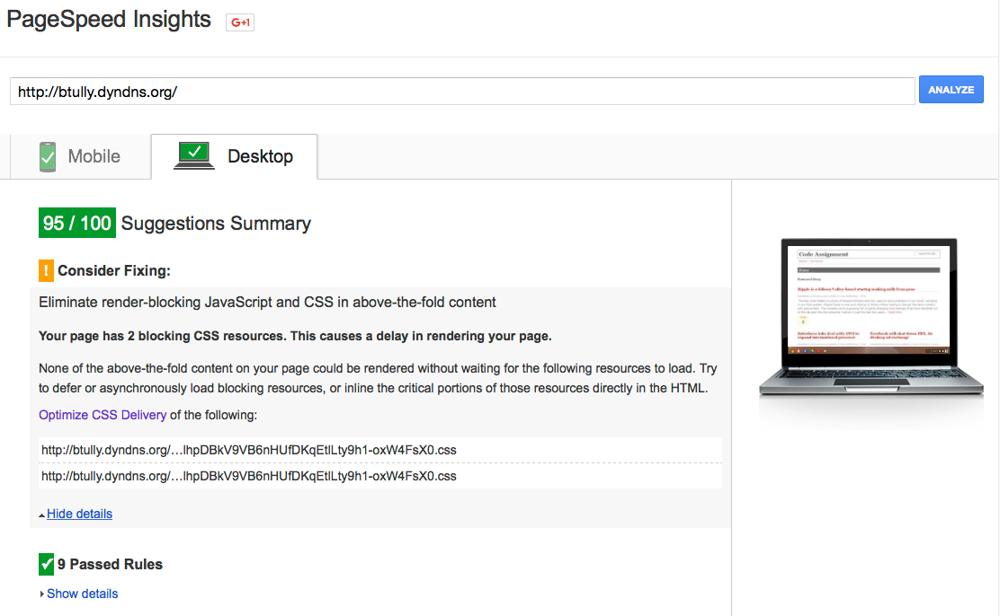

# 3. Final Results/Summary

### Executive Summary (TL;DR)

As detailed in the previous section, we used a variety of strategies and tools to help identify bottlenecks and improve site performance -- both real and "perceived" performance. By employing all of the recommended additions and modifications, we were able to see a drastic decrease in page load time, and came very close to the business goal of "under 500ms for a page load", depending on which metric/tool is doing the reporting. 

### Siege

<pre><code>
Transactions:		          50 hits
Availability:		         100.00 %
Elapsed time:		           2.84 secs
Data transferred:	           0.44 MB
Response time:		          0.01 secs
Transaction rate:	          17.61 trans/sec
Throughput:		             0.15 MB/sec
Concurrency:		            0.20
Successful transactions:       50
Failed transactions:	        0
Longest transaction:	        0.04
Shortest transaction:	       0.00
</code></pre>

Note that siege is reporting that our longest transaction is **0.04s** (40ms) -- a major improvement over our original longest transaction of **7.94 seconds** (7940ms) -- **a reduction of 7900 ms!**

### ApacheBench

ApacheBench also revealed very promising results:

<pre>Finished 14757 requests

Server Software:        Apache
Server Hostname:        btully.dyndns.org
Server Port:            80

Document Path:          /
Document Length:        39425 bytes

Concurrency Level:      1
Time taken for tests:   300.008 seconds
Complete requests:      14757
Failed requests:        0
Keep-Alive requests:    0
Total transferred:      591966517 bytes
HTML transferred:       581794725 bytes
Requests per second:    49.19 [#/sec] (mean)
Time per request:       20.330 [ms] (mean)
Time per request:       20.330 [ms] (mean, across all concurrent requests)
Transfer rate:          1926.92 [Kbytes/sec] received

Connection Times (ms)
              min  mean[+/-sd] median   max
Connect:        2    6   1.1      6      66
Processing:    12   14   3.9     14     276
Waiting:        2    4   1.8      4     171
Total:         16   20   4.2     20     282

Percentage of the requests served within a certain time (ms)
  50%     20
  66%     20
  75%     21
  80%     21
  90%     22
  95%     22
  98%     24
  99%     25
 100%    282 (longest request)
 </pre>

Note that in the same 5 minute testing period, we were able to make **2x** as many requests, **14757** vs 756. Our mean time per request was reduced from 396.876 ms all the way down to 20.330 ms - **an improvement of 376.546 ms** - and our longest request was reduced from 806 ms down to 282 ms -- **an improvement of 524 ms!**

### Google PageSpeed Insights

Our score improved from an **86** to a **95** thanks to many of the front end optimizations we implemented.

### WebPageTest

