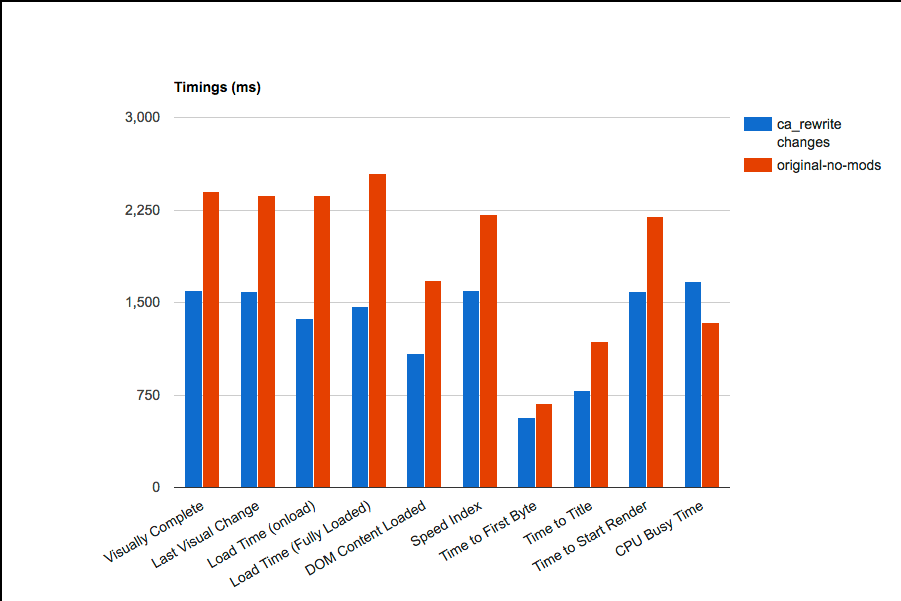
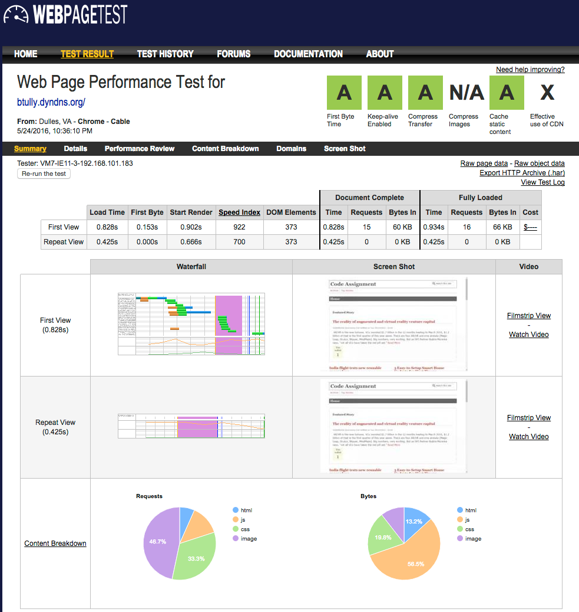
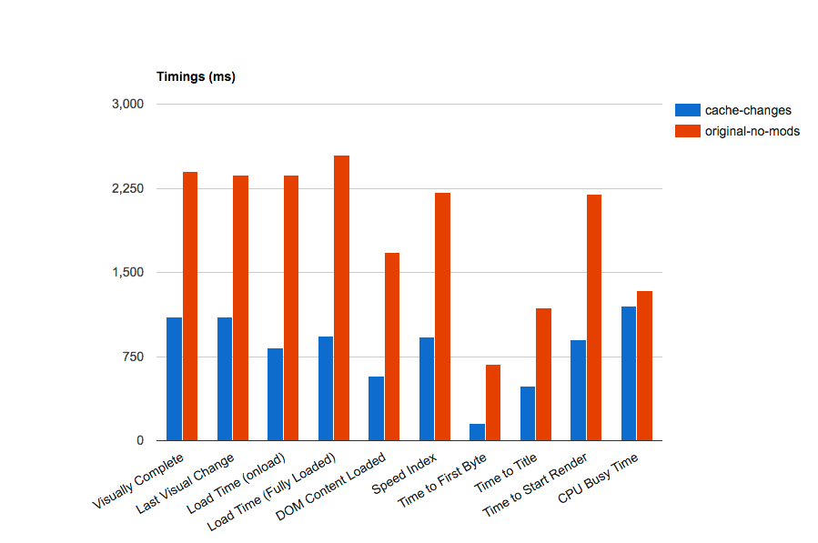
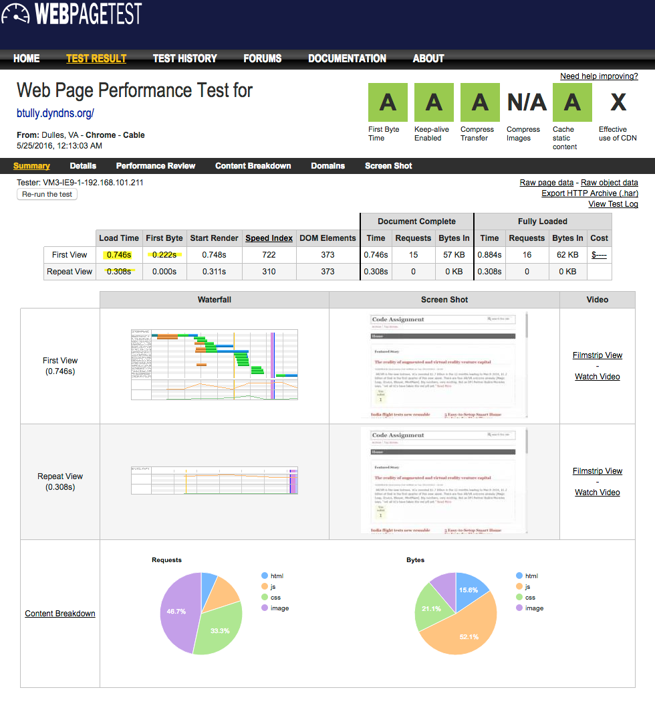
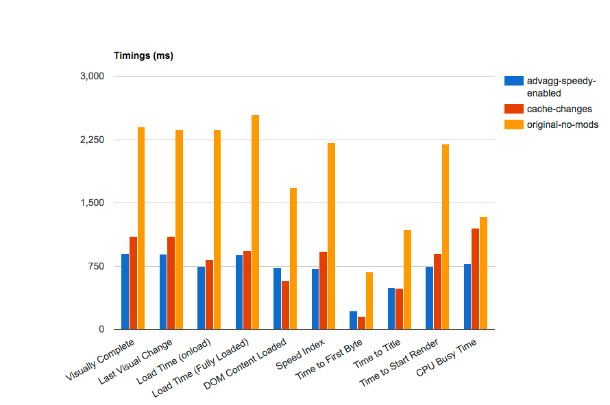
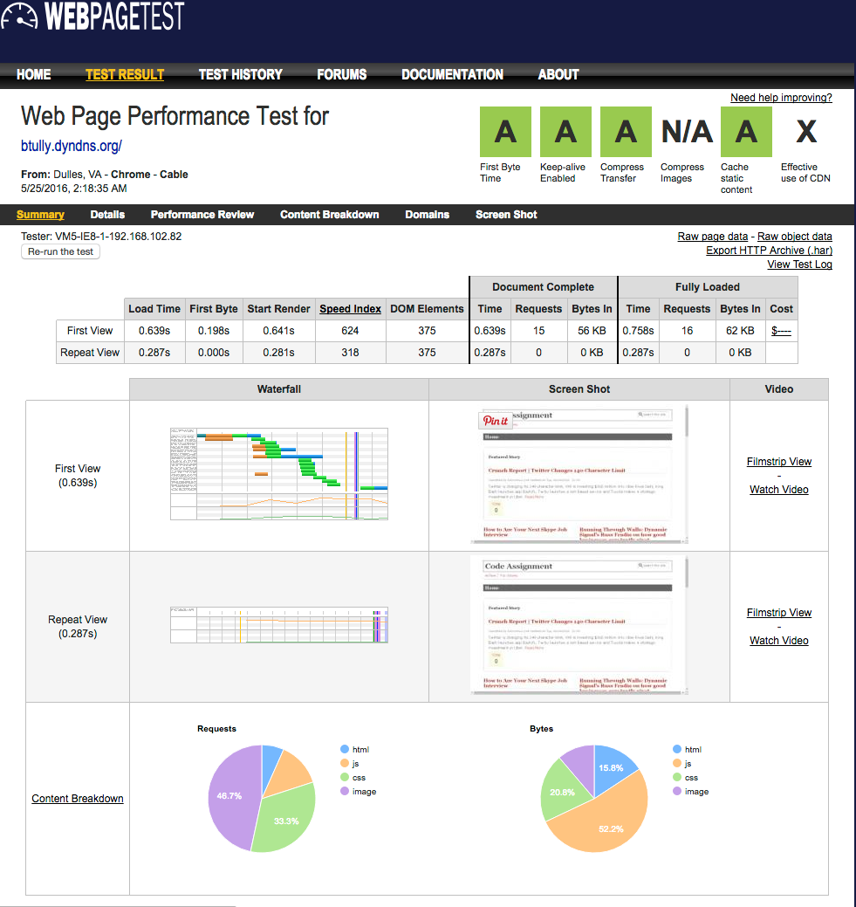
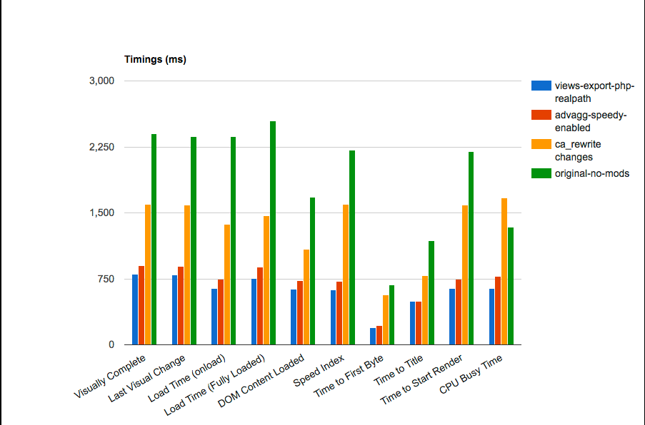

# Discovery/Recommendations

## xhprof Profiling

The use of the xhprof profiler did not reveal anything obvious. There were significant calls to the database for cache getting/setting (even with cache disabled), so this promotes the idea of using an external cache like Memcached to offload these calls from the database and improve performance.

**RECOMMENDATION: Install/configure Memcached
**

## Percona Toolkit / MySQL Slow Query Log

The MySQL slow query log was enabled in order to highlight any potential troublesome queries. Originally run with the default 1s limit, this produced no entries -- even with repeated cache clears and cron runs and using apachebench and siege to send many requests to the website. We reduced the limit down to 50ms and then 5ms before we started seeing entries. All queries were run through MySQL's EXPLAIN function to ensure they were using proper indexes and were optimized. 

**RECOMMENDATION: No obvious optimizations discovered at this time
**

## Code Refactoring

All core and contributed code looked up to date and working reliably. However, the **ca_rewrite module** has a potential optimization that should improve performance and cachebility. Currently the module uses hook_node_view_alter() to modify a node's title based on custom rewrite patterns. It modifies the title only on the render side, i.e., as a filter that gets called after the node is loaded and before the node is displayed. The concern is that for each view containing a list of nodes, for each node the view loads it then needs to call the database to get a list of rewrite patterns and apply them to each node in the view. On pages like the home page this gets expensive when you consider there are multiple (3) views. 

<pre><code style="language-php">
function ca_rewrite_node_view_alter(&$build) {
  // Node title is not run through text formats, so replace contents here.
  $build['#node']->title = ca_rewrite_filter_process($build['#node']->title);
}
</code></pre>

I experimented with this and refactored the code to use hook_node_presave() instead. The rationale is that the title filtering would only happen once when the node is created via feed import, rather than being run on every node on EVERY page view. Why not filter the title and store it that way in the database so that we can take better advantage of caching strategies?

<pre><code style="language-php">
function ca_rewrite_node_presave($node) {
  if ($node->type == 'feed_item') {
    // Alter title, run it through rewrite patterns:
    $node->title = ca_rewrite_filter_process($node->title);
  }
}
</code></pre>

While the performance gains weren't as obvious as I'd hoped, there was a noticeable improvement of about 500ms on average (see chart from WebPageTest comparison below).

While this appeared to be a small victory, it soon became obvious that this would only affect NEW nodes that are imported -- NOT existing nodes that had already been imported. So I added a hook_update_N function that leverages Drupal's Batch API and progressively updates all feed_item nodes with their filtered title.

<pre><code style="language-php">
/**
 * Implements hook_update_N().
 * Using Batch API, updates existing feed_items that were imported from feeds
 * and changes the titles based on ca_rewrite_patterns
 */
function ca_rewrite_update_7000(&$sandbox) {
  if (!isset($sandbox['max'])) {
    $query = db_select('node', 'n');
    $query->addExpression('COUNT(*)', 'count');
    $query->condition('n.type', 'feed_item');
    $sandbox['max'] = $query->execute()->fetchField();
    $sandbox['current_position'] = 0;
  }

  if ($sandbox['max'] > 0) {
    $limit = 10;
    $nids = db_select('node', 'n')
      ->fields('n', array('nid'))
      ->condition('n.type', 'feed_item')
      ->orderBy('n.nid')
      ->range($sandbox['current_position'], $limit)
      ->execute()
      ->fetchCol();
    $nodes = node_load_multiple($nids);
    foreach ($nodes as $node) {
      // ca_rewrite_node_presave() should filter the titles before saving
      node_save($node);
    }

    $sandbox['current_position'] += $limit;
    $sandbox['#finished'] = $sandbox['current_position'] / $sandbox['max'];
  }
  else {
    $sandbox['#finished'] = 1;
  }

  if ($sandbox['#finished'] >= 1) {
    return format_plural($sandbox['max'], '1 node updated', '@count nodes updated');
  }
}</code></pre>

**RECOMMENDATION: Use the refactored version of ca_rewrite module
**

## Image Optimization
* image "pat-1.png" was 7.5K and took 15ms to load
* optimized (lossless) down to 2.5K and now takes **4ms** to load!

## Cache Configurations

In the current site configuration, there are various cache configuration options within Drupal core (and modules) that are being underutilized.

Because the business needs require that feeds get updated every 5 minutes, at the very least we should be setting a minimum cache lifetime to 5 minutes for page cache, block cache, views cache, panels cache, etc.

**Recommended Changes
**

**Drupal Core Cache: 
**
* Cache pages for anonymous users - ON
* Cache blocks - ON
* Minimum cache lifetime: 5 minutes
* Expiration of cached pages: 5 minutes
* Compress cached pages - ON

**Views Cache:
**
* Content Lists: set to 5 minutes for Query results and Rendered output
* Related Articles: set to 5 minutes for Query results and Rendered output
* Top Rated: set to 5 minutes for Query results and Rendered output

**Panel Cache: 
**
* set homepage panels (top, left, right) to use simple cache - 5 minutes

**WEBPAGETEST RESULTS**

As you'll see from the above charts, setting reasonable defaults for cache configuration improved our score and reduced page load significantly! Straight A's! Note that our load time has decreased from 2.36s to 826ms for first view and 1.68s to 425ms for repeat view. Our Time to First Byte has decreased from 684ms/682ms to 153ms/0.00ms (First View/Repeat View) -- yes 0!

While this test was run directly after a cache clear and cron run, we were able to "cheat" by "priming the cache. Because cron is now running externally, I have set up an additional cron job to scrape the site's sitemap.xml file and visit all links defined in the sitemap. This means that the cache is primed by a shell script rather than a user/customer visiting your site. The **drupal-cache-warmer.sh** shell script run by cron contains the following  **wget** command:

> wget -q http://btully.dyndns.org/sitemap.xml --no-cache -O - | egrep -o "https://btully.dyndns.org[^<]+" | wget --header "Cookie: has_js=1" -U "cachewarmer" -q -i - -O /dev/null --wait 1

Even with this great news, there are still other options to explore and implement, which we'll highight below.

**FURTHER EXPLORATION/RECOMENDATIONS**

There are several Drupal modules that provide a more extensive set of features/options for priming the cache, especially if an external cache like Varnish is used:
* [Purge](https://www.drupal.org/project/purge)
* [HTTP Parallel Request & Threading Library](https://www.drupal.org/project/httprl)
* [Cache Warmer](https://www.drupal.org/project/cache_warmer)
* [Recacher](https://www.drupal.org/project/recacher)
* [Cache Expiration](https://www.drupal.org/project/expire)

## Other Configurations

### Voting API

Currently set to "Tally results whenever a vote is cast".

**Suggestion: It is slightly more performant to change this to "Tally votes on cron run" but the client would need to weigh the performance gains against the slightly diminished user experience.
**

### Database Logging

**RECOMMENDATION: Disable database logging and use syslog
**

## Recommended Additional Front End Modules

* [Speedy](https://www.drupal.org/project/speedy)
  * minify Drupal core JS and aggregate
* Advanced CSS/JS Aggregation
* AdvAgg Modifier

With Speedy and Advanced CSS/JS Aggregation modules enabled and configured, we see the following metrics:

Note that with advanced CSS/JS aggregation, our load time has decreased from 826ms to **746ms** for first view and 425ms to **308ms** for repeat view.

In the chart below you'll see a comparison of the work done so far:

**FURTHER EXPLORATION/RECOMMENDATION
**
* Ensure that whatever mechanism is clearing site cache (cron, drush) does so intelligently so that JS and CSS aggregate files are not frequently being rebuilt. We only want to rebuild these files when it's absolutely necessary (i.e., when a CSS or JS file has been changed). User's will cache these files in their browser and since these files are relatively large and block rendering, we want to limit the amount of times a user has to download them. By serving them from the user's browser cache, rendering performance is drastically improved.

## Exporting Views to Code
A common performance boost is to export views (through the Views UI) and store them on the filesystem as PHP code. With a custom Drupal module, you can then tell Views that your exported views can be loaded from the filesystem rather than loading them from the database. There are multiple advantages:
* Avoids many requests to the database
* With a properly configured php.ini (realpath_cache_size) and opcode cache (OpCache, XCache, etc.), the code can get loaded directly from the opcode cache for an additional performance boost.

The results below show that we are continuing to shave precious milleseconds off of both First View (-107ms) and Repeat View (-21ms).

## Memcached Integration

## Image / Theme Micro-optimizations
To remove extra requests from occurring on the homepage, the following changes were made:
* Removed "rounded corners" panel style from Top Story panel since it used 5 separate images (requests) to create rounded corners and shadow. If this style is required it should be recreated using CSS border-radius and box-shadow properties in order to avoid 5 blocking requests.
* The current theme (Mayo) uses a background image for the header. However the image is a white gradient that is only suitable for dark backgrounds and is not visible with the current theme colors. Since it is not visible, we recommend disabling the header_background property in the theme (currently set to enabled in the database) and therefore reduce another blocking request.

