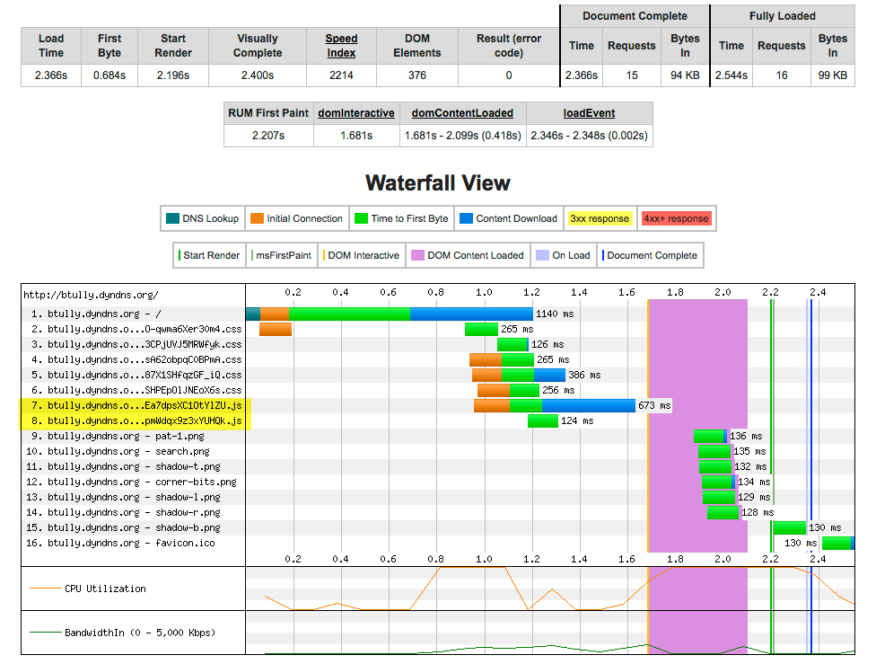

# Initial Benchmarks

Since our scope is performance and not scalability, we gathered some initial performance metrics using ApacheBench to test the web server response time.

<pre>ab -r -k -c 1 -n 100000000 -t 300 http://btully.dyndns.org/</pre>

The above command sends a request to the site for a total of 5 minutes so that we can see the effect of any cron/cache clear.

### Server Response Results
<pre>
Finished 756 requests

Server Software:        Apache
Server Hostname:        btully.dyndns.org
Server Port:            80

Document Path:          /
Document Length:        36344 bytes

Concurrency Level:      1
Time taken for tests:   300.038 seconds
Complete requests:      756
Failed requests:        0
Keep-Alive requests:    0
Total transferred:      27849528 bytes
HTML transferred:       27476064 bytes
Requests per second:    2.52 [#/sec] (mean)
Time per request:       396.876 [ms] (mean)
Time per request:       396.876 [ms] (mean, across all concurrent requests)
Transfer rate:          90.64 [Kbytes/sec] received

Connection Times (ms)
              min  mean[+/-sd] median   max
Connect:        2    4   0.6      4       7
Processing:   347  393  44.6    378     803
Waiting:      337  381  44.1    366     788
Total:        351  397  44.6    382     806

Percentage of the requests served within a certain time (ms)
  50%    382
  66%    395
  75%    413
  80%    425
  90%    440
  95%    468
  98%    512
  99%    568
 100%    806 (longest request)
 </pre>
 
 Server Response (waiting, processing) is in the **400 ms** response range on average, so we'll see if we can improve that.
 

###  Page Load Results: WebPageTest

We used WebPageTest.org to gather initial performance metrics on page load performance.

<table id="tableResults" class="pretty" align="center" border="1" cellpadding="10" cellspacing="0">
	<tbody>
		<tr>
			<th align="center" class="empty" valign="middle" style="border:1px white solid;"></th>
			<th align="center" class="empty" valign="middle" colspan="5"></th>
			<th align="center" class="border" valign="middle" colspan="3">Document Complete</th>
			<th align="center" class="border" valign="middle" colspan="4">Fully Loaded</th>
		</tr>
		<tr>
			<th align="center" class="empty" valign="middle"></th>
			<th align="center" valign="middle">Load Time</th>
			<th align="center" valign="middle">First Byte</th>
			<th align="center" valign="middle">Start Render</th>
			<th align="center" valign="middle"><a href="https://sites.google.com/a/webpagetest.org/docs/using-webpagetest/metrics/speed-index" target="_blank">Speed Index</a></th>
			<th align="center" valign="middle">DOM Elements</th>
			<th align="center" class="border" valign="middle">Time</th>
			<th align="center" valign="middle">Requests</th>
			<th align="center" valign="middle">Bytes In</th>
			<th align="center" class="border" valign="middle">Time</th>
			<th align="center" valign="middle">Requests</th>
			<th align="center" valign="middle">Bytes In</th>
			<th align="center" valign="middle">Cost</th>
		</tr>
		<tr>
			<td align="left" valign="middle">First View </td>
			<td id="fvLoadTime" valign="middle">2.366s</td>
			<td id="fvTTFB" valign="middle">0.684s</td>
			<td id="fvStartRender" valign="middle">2.196s</td>
			<td id="fvVisual" valign="middle">2214</td>
			<td id="fvDomElements" valign="middle">376</td>
			<td id="fvDocComplete" class="border" valign="middle">2.366s</td>
			<td id="fvRequestsDoc" valign="middle">15</td>
			<td id="fvBytesDoc" valign="middle">94 KB</td>
			<td id="fvFullyLoaded" class="border" valign="middle">2.544s</td>
			<td id="fvRequests" valign="middle">16</td>
			<td id="fvBytes" valign="middle">99 KB</td>
		</tr>
		<tr>
			<td align="left" class="even" valign="middle">Repeat View </td>
			<td id="rvLoadTime" class="even" valign="middle">1.684s</td>
			<td id="rvTTFB" class="even" valign="middle">0.682s</td>
			<td id="rvStartRender" class="even" valign="middle">0.803s</td>
			<td id="rvVisual" class="even" valign="middle">1798</td>
			<td id="rvDomElements" class="even" valign="middle">376</td>
			<td id="rvDocComplete" class="even border" valign="middle">1.684s</td>
			<td id="rvRequestsDoc" class="even" valign="middle">1</td>
			<td id="rvBytesDoc" class="even" valign="middle">37 KB</td>
			<td id="rvFullyLoaded" class="even border" valign="middle">1.684s</td>
			<td id="rvRequests" class="even" valign="middle">1</td>
			<td id="rvBytes" class="even" valign="middle">37 KB</td>
		</tr>
	</tbody>
</table>

###  Page Load Results: Google PageSpeed Insights

